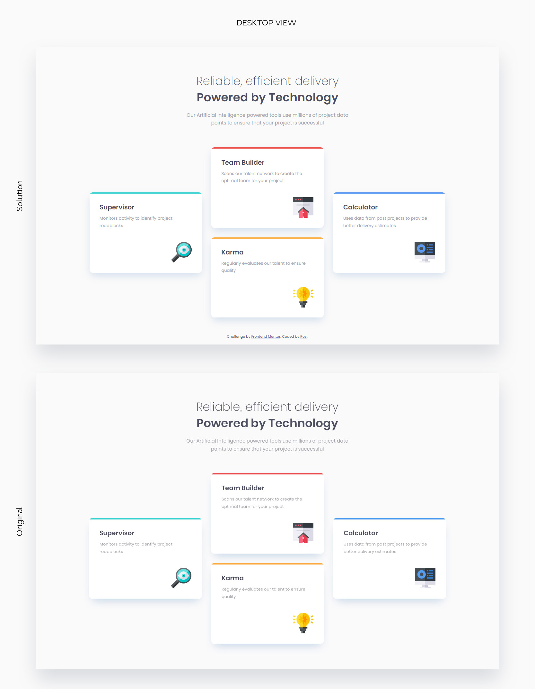

# Frontend Mentor - Four card feature section solution

This is a solution to the [Four card feature section challenge on Frontend Mentor](https://www.frontendmentor.io/challenges/four-card-feature-section-weK1eFYK). Frontend Mentor challenges help you improve your coding skills by building realistic projects. 

## Table of contents

- [Overview](#overview)
  - [The challenge](#the-challenge)
  - [Screenshot](#screenshot)
  - [Links](#links)
- [My process](#my-process)
  - [Built with](#built-with)
  - [What I learned](#what-i-learned)

## Overview

### The challenge

Users should be able to:

- View the optimal layout for the site depending on their device's screen size

### Screenshot

### Links

- Solution URL: [Four card feature section solution](https://github.com/strosi/frontend-mentor-challenges/tree/main/four-card-feature-section-master)
- Live Site URL: [Four card feature section live site](https://strosi.github.io/frontend-mentor-challenges/four-card-feature-section-master/)

## My process

### Built with

This was build with base front-end technologies and approaches including:
- Semantic HTML5 markup
- Sass preprocessor
- Flexbox
- Mobile-first workflow
- BEM methodology for styles

### What I learned

The task was more for practicing what was already learned in the previous challenges. I tried to add a little animation on card hovering and the interesting for me was pseudo element stack order.
