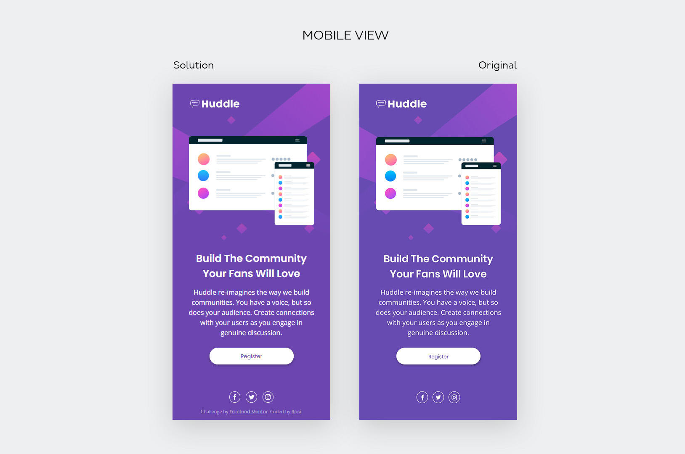
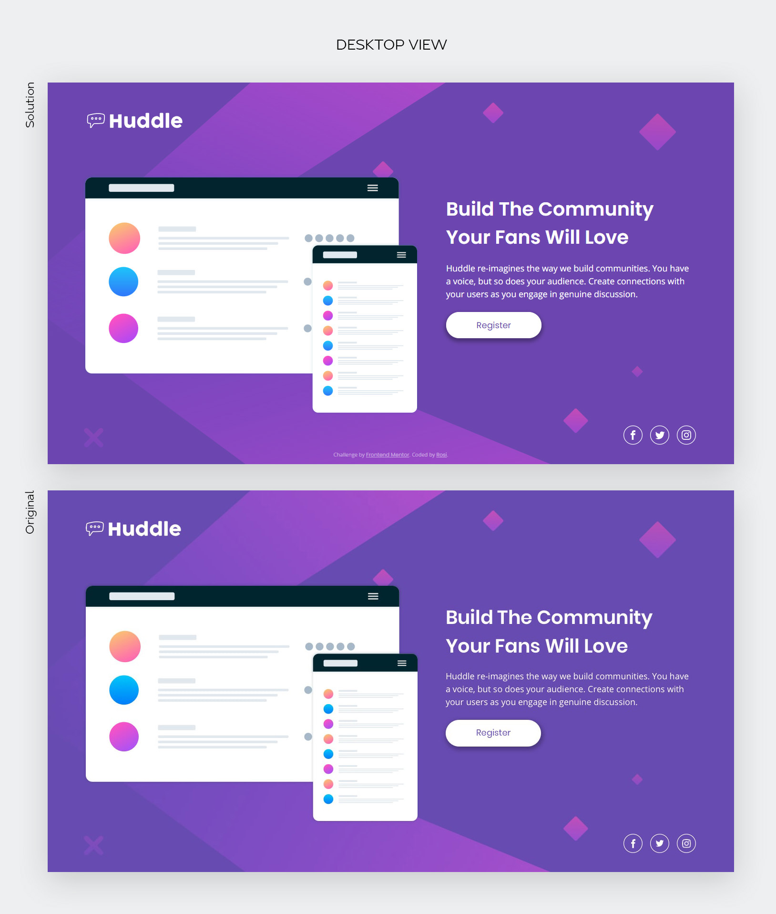

# Frontend Mentor - Huddle landing page with single introductory section solution

This is a solution to the [Huddle landing page with single introductory section challenge on Frontend Mentor](https://www.frontendmentor.io/challenges/huddle-landing-page-with-a-single-introductory-section-B_2Wvxgi0). Frontend Mentor challenges help you improve your coding skills by building realistic projects. 

## Table of contents

- [Overview](#overview)
  - [The challenge](#the-challenge)
  - [Screenshot](#screenshot)
  - [Links](#links)
- [My process](#my-process)
  - [Built with](#built-with)
  - [What I learned](#what-i-learned)

## Overview

### The challenge

Users should be able to:

- View the optimal layout for the page depending on their device's screen size
- See hover states for all interactive elements on the page

### Screenshot

### Links

- Solution URL: [View code here](https://github.com/strosi/frontend-mentor-challenges/tree/main/huddle-landing-page-with-single-introductory-section-master)
- Live Site URL: [View solution in action](https://strosi.github.io/frontend-mentor-challenges/huddle-landing-page-with-single-introductory-section-master/)

## My process

### Built with

- Semantic HTML5 markup
- Sass preprocessor
- Flexbox
- Mobile-first workflow

### What I learned

I use this challenge to try some simple text and button effects on page loading.
