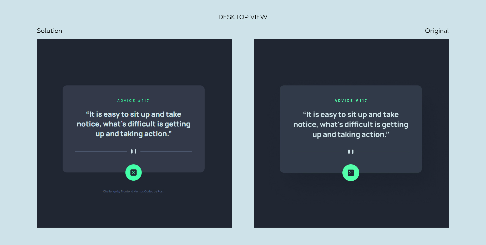

# Frontend Mentor - Advice generator app solution

This is a solution to the [Advice generator app challenge on Frontend Mentor](https://www.frontendmentor.io/challenges/advice-generator-app-QdUG-13db). Frontend Mentor challenges help you improve your coding skills by building realistic projects.

## Table of contents

- [Overview](#overview)
  - [The challenge](#the-challenge)
  - [Screenshot](#screenshot)
  - [Links](#links)
- [My process](#my-process)
  - [Built with](#built-with)
  - [What I learned](#what-i-learned)
  - [Useful resources](#useful-resources)
- [Acknowledgments](#acknowledgments)

## Overview

### The challenge

Users should be able to:
- Generate a new piece of advice by clicking the dice icon
- See hover and click state for the dice button

### Screenshot

### Links

- Solution URL: [View code here](https://github.com/strosi/frontend-mentor-challenges/tree/main/junior/advice-generator-app-main)
- Live Site URL: [View solution in action](https://strosi.github.io/frontend-mentor-challenges/junior/advice-generator-app-main/)

## My process

### Built with

- Semantic HTML5 markup
- Sass preprocessor
- Flexbox
- Mobile-first workflow
- [React](https://reactjs.org/) - JS library
- [React Transition Group](https://reactcommunity.org/react-transition-group/) - React library

### What I learned

This simple app was great for practising React. I tried for the first time React Transition Group and fetching data from an API.
I learned to:
- embed React in existing HTML document without `creat-react-app`,
- use the React Transition Group library to add transition effect to some elements.

### Useful resources

- [Add React to a Website](https://reactjs.org/docs/add-react-to-a-website.html) - Here I found how to include React in existing page.
- [How to Add Animations with React Transition Group](https://blog.openreplay.com/how-to-add-animations-with-react-transition-group) - Useful React Transition Group introduction.
- [React Transition Group](https://reactcommunity.org/react-transition-group/) - This helped me setting up CSSTransition and used the link in the HTML to access the library externally.

### Time to complete
Aproximatly 6h including:
- setting up HTML (15 min),
- setting up styles (1h 30m),
- React (more than 3h) - searching how to embed React code in existing page took me a lot of the time,
- React Transition Group (about an hour).

## Acknowledgments

Always thankful to all smart people who share their work on the net (articles, solutions, videos, answers...)!
