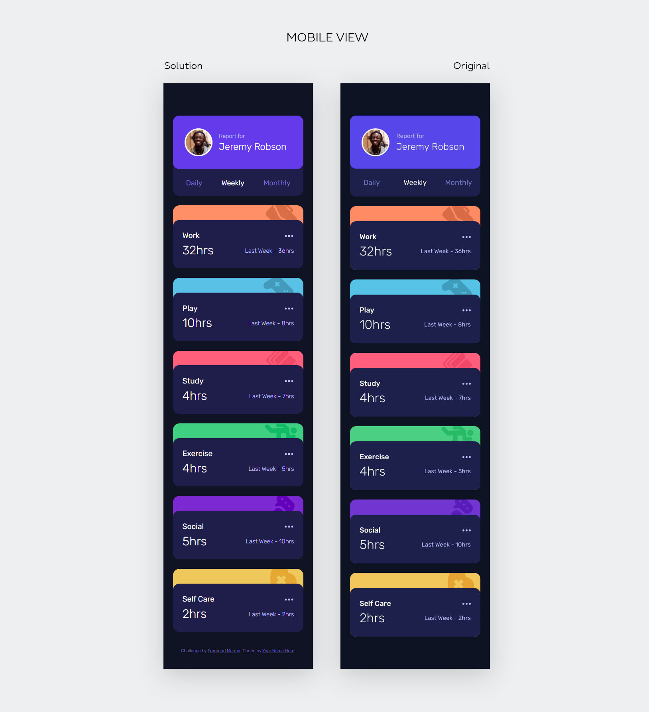
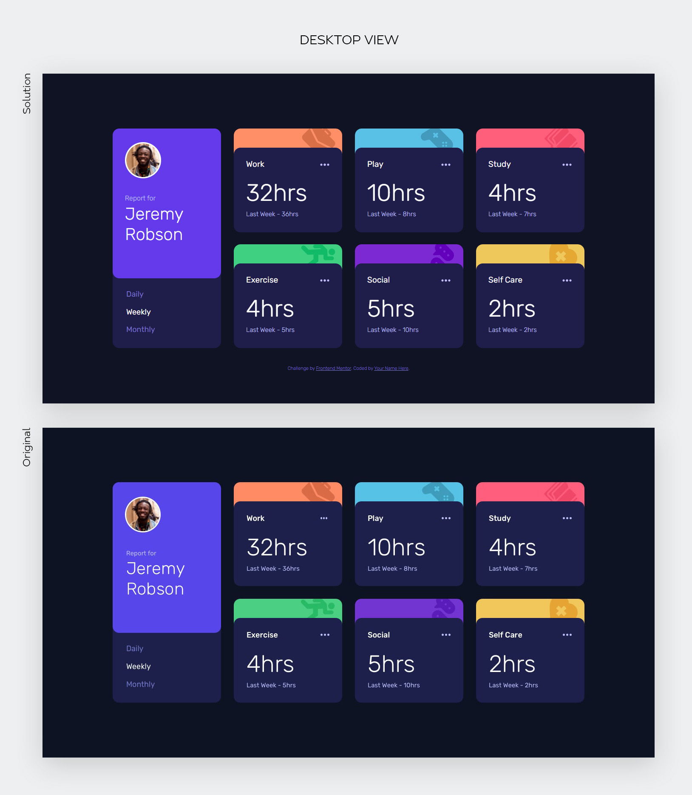

# Frontend Mentor - Time tracking dashboard solution

This is a solution to the [Time tracking dashboard challenge on Frontend Mentor](https://www.frontendmentor.io/challenges/time-tracking-dashboard-UIQ7167Jw). Frontend Mentor challenges help you improve your coding skills by building realistic projects. 

## Table of contents

- [Overview](#overview)
  - [The challenge](#the-challenge)
  - [Screenshot](#screenshot)
  - [Links](#links)
- [My process](#my-process)
  - [Built with](#built-with)
  - [What I learned](#what-i-learned)
  - [Useful resources](#useful-resources)
- [Acknowledgments](#acknowledgments)

**Note: Delete this note and update the table of contents based on what sections you keep.**

## Overview

### The challenge

Users should be able to:

- View the optimal layout for the site depending on their device's screen size
- See hover states for all interactive elements on the page
- Switch between viewing Daily, Weekly, and Monthly stats

### Screenshot

### Links

- Solution URL: [View code here](https://github.com/strosi/frontend-mentor-challenges/edit/main/junior/time-tracking-dashboard-main/)
- Live Site URL: [View solution in action](https://strosi.github.io/frontend-mentor-challenges/junior/time-tracking-dashboard-main/)

## My process

### Built with

- Semantic HTML5 markup
- Sass preprocessor
- Flexbox
- CSS Grid
- Vanilla JS
- Fetch API
- Mobile-first workflow

### What I learned

In this challenge I tried to:
- use the fetch API to get data from JSON file;
- show dynamic content on the page;
- work with different radio buttons groups;
- attach listneres to radio buttons;
- use CSS animation.

### Useful resources

- [Learn Fetch API In 6 Minutes](https://www.youtube.com/watch?v=cuEtnrL9-H0) - Some basics of fetch API - video
- [How to Use the JavaScript Fetch API to Get Data?](https://www.geeksforgeeks.org/how-to-use-the-javascript-fetch-api-to-get-data/) - Example of fetch API usage
- [Learn CSS Grid the easy way](https://www.youtube.com/watch?v=rg7Fvvl3taU) - Basics of using Grids
- [The input element - type=radio](https://developer.mozilla.org/en-US/docs/Web/HTML/Element/input/radio) - How radio buttons work
- [Building Accessible Menu Systems](https://www.smashingmagazine.com/2017/11/building-accessible-menu-systems/) - I found this helpful for creating the three dot menu...
- [Close menu on click outside - Vanilla JS](https://stackoverflow.com/questions/61168579/close-menu-on-click-outside-vanilla-js) - Took an idea from here how to close the options menu on clicking outside it.
- [Text reveal animation - Codepen](https://codepen.io/michielvandewalle/pen/KaGoyq?editors=1100) - Took an idea for the numbers animation.

## Acknowledgments

Always thankful to all smart people in the net for creating their work (articles, solutions to different problems and answers)!
