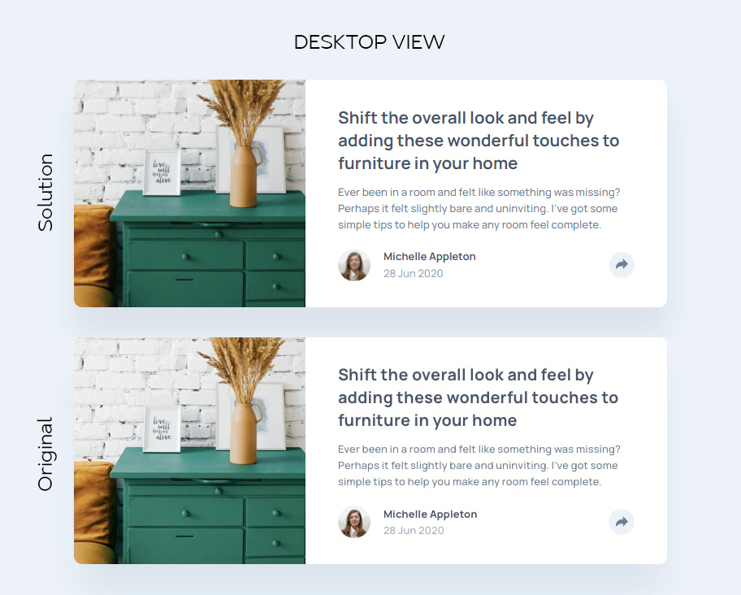
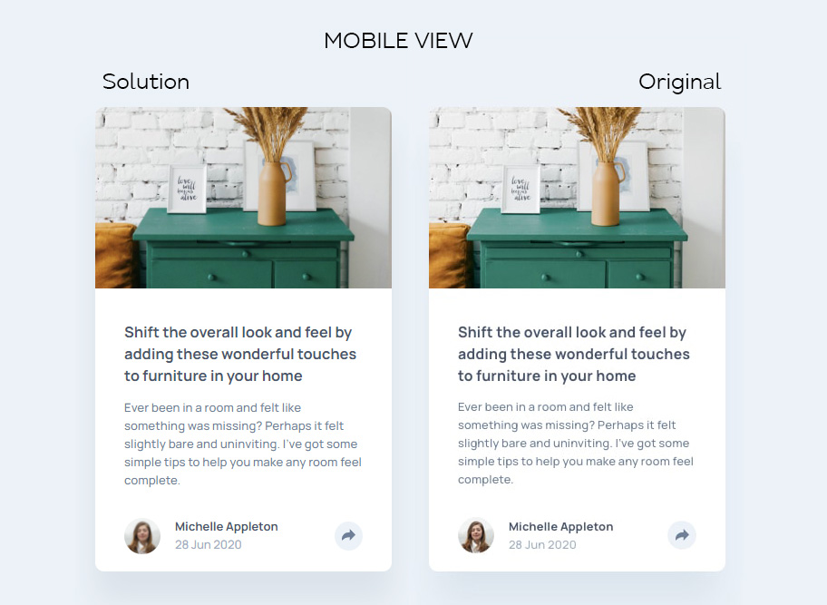

# Frontend Mentor - Article preview component solution

This is a solution to the [Article preview component challenge on Frontend Mentor](https://www.frontendmentor.io/challenges/article-preview-component-dYBN_pYFT). Frontend Mentor challenges help you improve your coding skills by building realistic projects. 

## Table of contents

- [Overview](#overview)
  - [The challenge](#the-challenge)
  - [Screenshot](#screenshot)
  - [Links](#links)
- [My process](#my-process)
  - [Built with](#built-with)
  - [What I learned](#what-i-learned)
  - [Useful resources](#useful-resources)

## Overview

### The challenge

Users should be able to:

- View the optimal layout for the component depending on their device's screen size
- See the social media share links when they click the share icon

### Screenshot

### Links

- Solution URL: [Article preview component code](https://github.com/strosi/frontend-mentor-challenges/tree/main/article-preview-component-master)
- Live Site URL: [Article preview component live site](https://strosi.github.io/frontend-mentor-challenges/article-preview-component-master/)

## My process

### Built with

This little piece of work was build with base front-end technologies and approaches including:
- Semantic HTML5 markup
- Sass preprocessor
- Flexbox
- JavaScript
- Mobile-first workflow
- BEM methodology for styles

### What I learned

It was interesting to learn how to build accessible tooltip and to read about ARIA attributes. I had to recollect JS for haven't written in it for a while.

### Useful resources

Links I used while googling about accessible tooltip:
- [Information about some ARIA attributes](https://developer.mozilla.org/en-US/docs/Web/Accessibility/ARIA/Roles/tooltip_role)
- [Thoughts on how to create tooltip](https://www.sarasoueidan.com/blog/accessible-tooltips/)
- [Tooltip example](https://codepen.io/emoyal4/pen/vYJWjKv) - Took a hint from here for the JS code.
