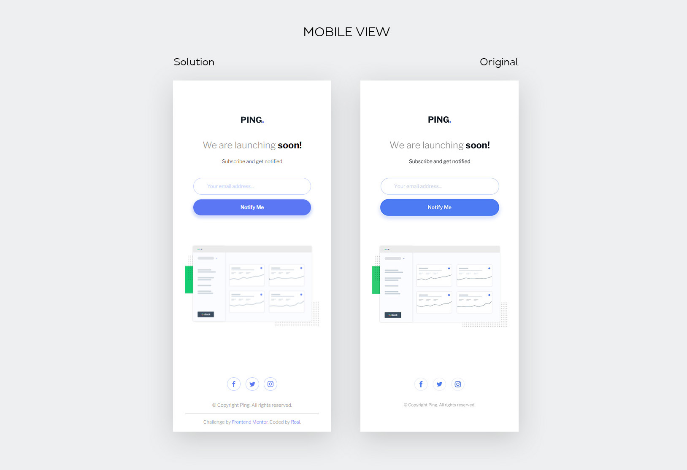
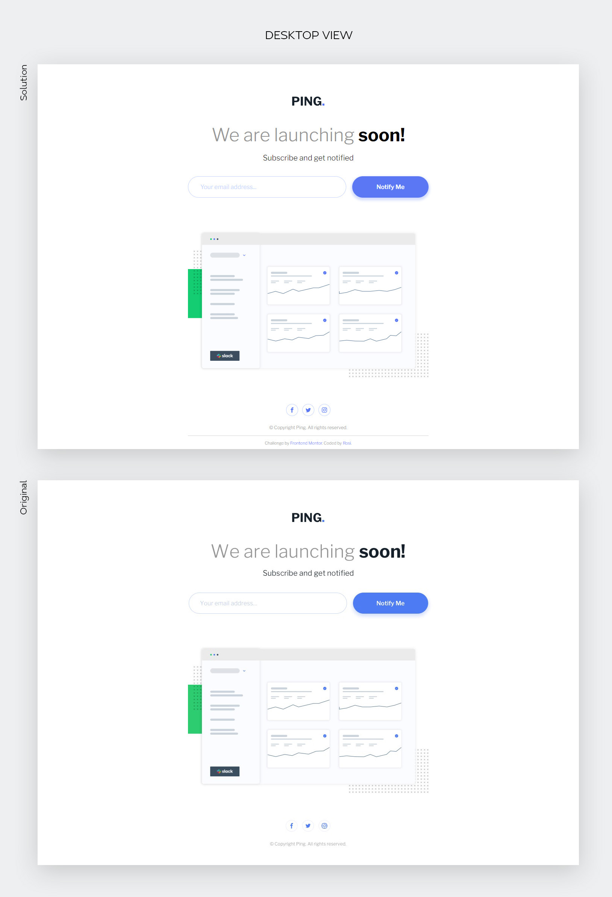

# Frontend Mentor - Ping coming soon page solution

This is a solution to the [Ping coming soon page challenge on Frontend Mentor](https://www.frontendmentor.io/challenges/ping-single-column-coming-soon-page-5cadd051fec04111f7b848da). Frontend Mentor challenges help you improve your coding skills by building realistic projects. 

## Table of contents

- [Overview](#overview)
  - [The challenge](#the-challenge)
  - [Screenshot](#screenshot)
  - [Links](#links)
- [My process](#my-process)
  - [Built with](#built-with)
  - [What I learned](#what-i-learned)
  - [Continued development](#continued-development)
  - [Useful resources](#useful-resources)

## Overview

### The challenge

Users should be able to:

- View the optimal layout for the site depending on their device's screen size
- See hover states for all interactive elements on the page
- Submit their email address using an `input` field
- Receive an error message when the `form` is submitted if:
	- The `input` field is empty. The message for this error should say *"Whoops! It looks like you forgot to add your email"*
	- The email address is not formatted correctly (i.e. a correct email address should have this structure: `name@host.tld`). The message for this error should say *"Please provide a valid email address"*

### Screenshot

### Links

- Solution URL: [View code here](https://github.com/strosi/frontend-mentor-challenges/tree/main/newbie/ping-coming-soon-page-master)
- Live Site URL: [View solution in action](https://strosi.github.io/frontend-mentor-challenges/newbie/ping-coming-soon-page-master/)

## My process

### Built with

- Semantic HTML5 markup
- Sass preprocessor
- Flexbox
- JavaSript
- Mobile-first workflow

### What I learned

I found in this challenge good opporunity to read about and try:
- CSS methods min(), max() and clamp(),
- CSS reset.

### Continued development

I tried to add confirmation when form is submitted successfully and found it difficult to include new functionality... There is need to read more about writing scalable code.

### Useful resources

- [min(), max(), and clamp() are CSS magic!](https://www.youtube.com/watch?v=U9VF-4euyRo), [CSS-tricks notes on the video](https://css-tricks.com/min-max-and-clamp-are-css-magic/) - I really needed this to make text more flexible on resizse.
- [Compiling clamp(), min(), and max() with sass](https://hellogreg.org/min-max-clamp-with-sass/) - Here is mentioned the problem with Sass and the clamp(), min() and max() methods. From my experience the problem doesn't exist anymore but it was interesting reading.
- [Modern CSS Reset](https://www.joshwcomeau.com/css/custom-css-reset/) - Made me rethink how to reset my styles...
