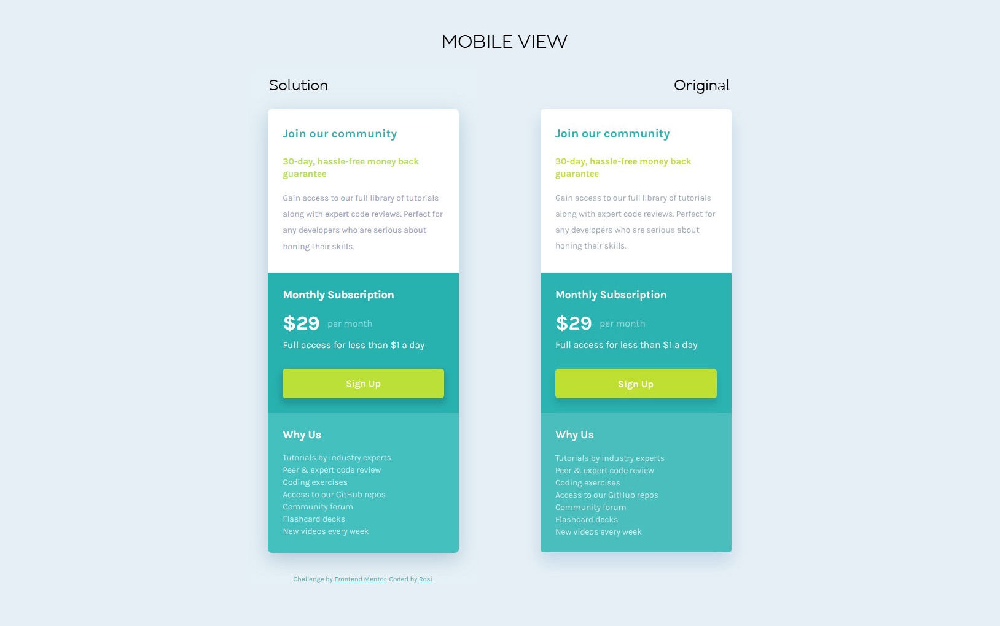

# Frontend Mentor - Single price grid component solution

This is a solution to the [Single price grid component challenge on Frontend Mentor](https://www.frontendmentor.io/challenges/single-price-grid-component-5ce41129d0ff452fec5abbbc). Frontend Mentor challenges help you improve your coding skills by building realistic projects. 

## Table of contents

- [Overview](#overview)
  - [The challenge](#the-challenge)
  - [Screenshot](#screenshot)
  - [Links](#links)
- [My process](#my-process)
  - [Built with](#built-with)
  - [What I learned](#what-i-learned)
 
## Overview

### The challenge

Users should be able to:

- View the optimal layout for the component depending on their device's screen size
- See a hover state on desktop for the Sign Up call-to-action

### Screenshot

### Links

- Solution URL: [View code here](https://github.com/strosi/frontend-mentor-challenges/tree/main/single-price-grid-component-master)
- Live Site URL: [View solution in action here](https://strosi.github.io/frontend-mentor-challenges/single-price-grid-component-master/)

## My process

### Built with

- Semantic HTML5 markup
- Sass preprocessor
- Flexbox
- Mobile-first workflow

### What I learned

The challenge was very useful for practicing how to:
- generate new colors with built-in modules and
- define custom functions in Sass.  

I played with transition effects to add a little interactivity in desktop view.
